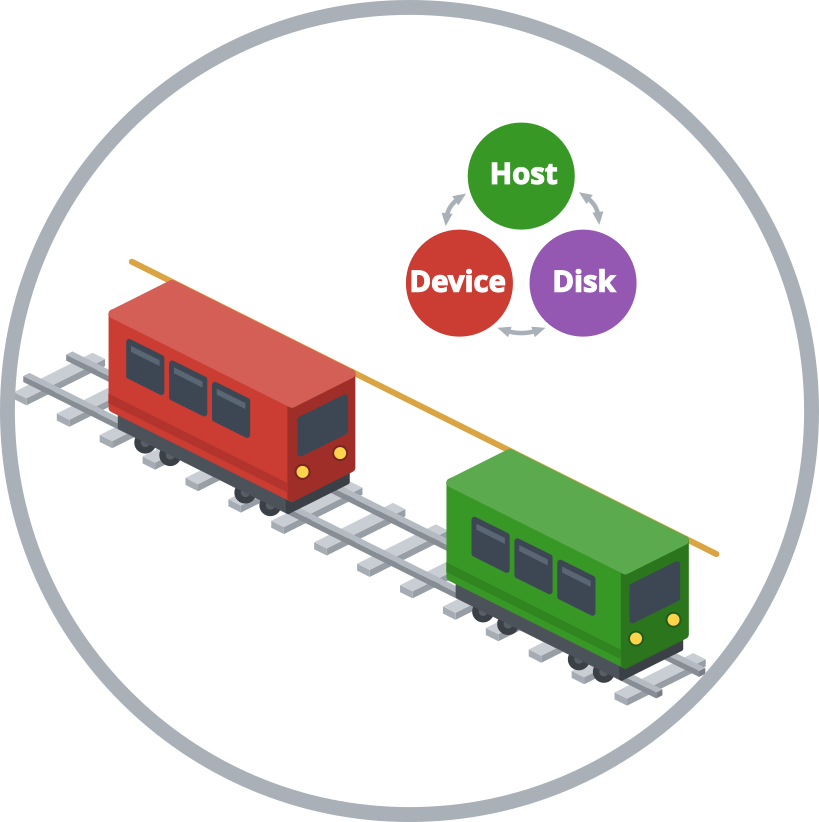

# Funicular.jl



[](https://github.com/PaulVirally/Funicular.jl/actions/workflows/CI.yml)
[](https://paulvirally.github.io/Funicular.jl/stable/)

Tiered-residency storage and a streaming pipeline for tall-skinny complex
matrices, plus the panel-granular linear algebra that matrix-free randomized
methods need on top of it.

A randomized method applied to a large matrix-free operator keeps a basis of
`N × k` with `N` in the tens of millions. At `N = 10⁷` one column is 160 MB in
ComplexF64, and a thousand of them are more than any single GPU or node holds,
though a panel of a few dozen columns does fit. As such, Funicular cuts the
matrix into column panels, keeps them on disk or in page-locked host memory,
and streams them through the GPU behind the compute that is already running
there. Applying such an operator usually costs several times what moving its
argument costs, so nearly all of the transfer cost disappears.

```julia
using CUDA, Funicular, HDF5, LinearAlgebra

plan = ResidencyPlan(backend = Funicular.cuda_backend(),
                     device_budget = 0.7 * CUDA.total_memory(),
                     host_budget = 200 * 2^30,
                     scratch_dir = "/scratch/$(ENV["USER"])/funicular")

Ω = GhostPanels(ComplexF64, N, k; plan = plan, seed = 0x5EED)
Y = PanelMatrix{ComplexF64}(undef, N, k; plan = plan)

panelmul!(Y, G, Ω) # apply the operator, streamed and double buffered
cholqr2!(Y)        # orthonormalize in place
S = project(Y, G)  # the k × k projected operator
```

`G` is anything with `size`, `eltype`, `adjoint` and `mul!` on device vectors:
your own matrix-free operator, a `LinearMap`, or a plain matrix.

The [documentation](https://paulvirally.github.io/Funicular.jl/stable/) covers
when this package is and is not the right tool, the arithmetic behind the
pipeline, how to size the budgets, the operator contract, a guide to porting an
existing randomized method, and a complete runnable demo.

## Testing

```
julia --project -e 'using Pkg; Pkg.test()'
```

runs the whole suite on the CPU reference backend, whose "device" is a plain
array and whose queues are chains of tasks with injected jitter, so ordering
mistakes fail here rather than on a GPU node. `test/metal` and `test/cuda` are
environments that add a GPU backend and run the same suite against it.
